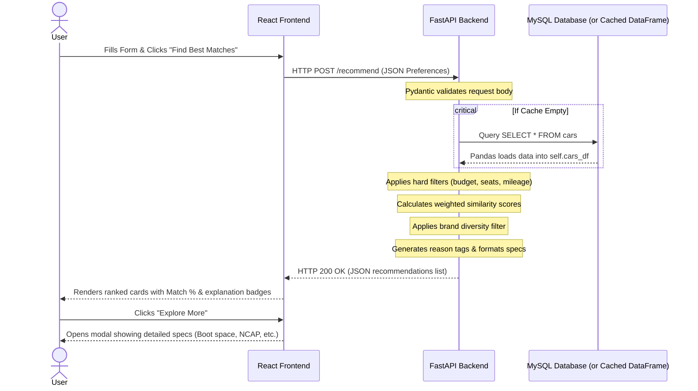

# Smart Car Recommendation System — System Architecture

This document describes the overall architecture of the **Smart Car Recommendation System**, including the software components, database structure, data flow, dataset preprocessing, and the multi-criteria weighted recommendation engine. 

The Smart Car Recommendation System uses a rule-based recommendation engine with a weighted scoring mechanism rather than a machine learning model. This ensures deterministic, explainable, and highly relevant recommendations tailored to what matters most to a car buyer.

---

## Overall Architecture

The application follows a standard three-tier containerized architecture consisting of a frontend, backend, and database.

```text
                     User
                       │
                       ▼
                 React Frontend
                       │
             HTTP REST API Requests
                       │
                       ▼
                FastAPI Backend
                       │
              Request Validation
                  (Pydantic)
                       │
                       ▼
         Weighted Recommendation Engine
                       │
             SQLAlchemy + Pandas
                       │
                       ▼
                MySQL Database
```

---

## Component Overview

### Frontend
The frontend is built using **React** and styled with **Vanilla CSS** for a clean, responsive, and modern user interface.

Its responsibilities include:
* **Preference Collection**: Providing an intuitive user questionnaire for capturing car preferences (budget, fuel type, transmission, body type, seating, minimum mileage, and minimum safety rating).
* **API Communication**: Sending validated HTTP POST requests containing user parameters to the backend API.
* **Results Display**: Visualizing recommended cars as cards sorted by match percentage, along with explanation badges ("match reasons").
* **Detailed Specifications**: Rendering an "Explore More" details modal detailing key strengths, things to consider, and exact specifications.

### Backend
The backend is developed using **FastAPI** (Python).

Its responsibilities include:
* **API Entrypoint**: Exposing endpoints for checking service health (`/health`) and generating car recommendations (`/recommend`).
* **Input Validation**: Utilizing **Pydantic** models to validate request payloads before processing.
* **Data Layer Coordination**: Checking database seeding status on startup, seeding data from `cars_in.csv` if the database is empty, and caching the active dataset in memory using **Pandas**.
* **Recommendation Logic**: Executing the weighted matching engine, sorting options, enforcing brand diversity, and dynamically compiling match reasons.

### Database
The application uses a **MySQL** database containerized with Docker.

* **Relational Schema**: Standardizes car attributes such as price boundaries, seating capacity, safety rating, fuel types, transmission options, and physical dimensions.
* **Seed Optimization**: The backend loads this dataset into memory (`self.cars_df`) using Pandas and SQLAlchemy when the service starts. This minimizes database queries during subsequent recommendation requests, ensuring fast response times.

---

## Recommendation Engine Architecture

Instead of predicting vehicle matches using a machine learning model, the Smart Car Recommendation System uses a rule-based recommendation engine utilizing a multi-criteria weighted scoring algorithm. 

The workflow is illustrated below:

```text
            User Preferences
                    │
                    ▼
            Input Validation
                    │
                    ▼
          Apply Hard Constraints
        (Budget, Seats, Mileage)
                    │
                    ▼
        Calculate Attribute Scores
     (Budget, Fuel, Gearbox, Safety...)
                    │
                    ▼
       Apply Priority Weight System
           (from config.py)
                    │
                    ▼
         Calculate Match Percent
                    │
                    ▼
        Enforce Brand Diversity
                    │
                    ▼
        Generate Match Reason Tags
                    │
                    ▼
          Return Top 5 Choices
```

---

## Recommendation Logic

The recommendation engine generates personalized car choices using the following rules and calculations:

### 1. Hard Constraints (Pre-Filtering)
Before scoring, the engine filters out vehicles that fail to satisfy basic user criteria to avoid showing incompatible options:
* **Budget Ceiling**: Excludes cars where the minimum price exceeds **130%** of the user's budget (`Price_Min_Lakh > budget * 1.3`).
* **Minimum Seating**: Excludes cars that cannot accommodate the requested passenger capacity (`Seating_Max < seating`).
* **Minimum Mileage**: Excludes cars with average mileage lower than requested (`Mileage_Avg_kmpl < min_mileage`).

### 2. Attribute Similarity Scoring
Cars passing the filters are evaluated on each preference parameter, yielding a score between `0.0` and `1.0`:

* **Budget Compatibility (`get_budget_score`)**:
  * Returns `1.0` if the user's budget falls inside the vehicle's min-max price range.
  * Otherwise, calculates the absolute gap to the nearest boundary and applies a penalty relative to the user's budget:
    $$\text{penalty} = \frac{\min(|user\_budget - min\_price|, |user\_budget - max\_price|)}{\max(user\_budget, 1)}$$
    $$\text{score} = \max(0, 1 - \text{penalty})$$

* **Fuel Type & Transmission Compatibility (`check_user_prefs`)**:
  * Returns `1.0` if the user preference matches the vehicle's primary fuel/transmission type.
  * Returns `0.75` for secondary fuel/transmission capabilities (e.g., if a car supports Petrol & CNG, or Manual & Automatic).
  * Returns `0.0` if no overlap exists.

* **Body Style Compatibility (`get_body_score`)**:
  * Returns `1.0` for an exact case-insensitive match on body style, and `0.0` otherwise.

* **Seating Compatibility (`get_seating_score`)**:
  * Returns `1.0` if the requested seats fall within the car's min-max capacity.
  * Returns `0.75` if the vehicle provides more seats than required.
  * Returns `0.0` if it has fewer.

* **Mileage Compatibility (`get_mileage_score`)**:
  * Returns `1.0` if the car's mileage meets or exceeds the user's minimum requirement.
  * Returns a proportional score (`car_avg_mileage / user_min_mileage`) if it falls short.
  * Returns a neutral `0.5` if car mileage data is unavailable or a placeholder.

* **Safety Rating Compatibility (`get_safety_score`)**:
  * Returns `1.0` if the safety rating meets or exceeds the user's minimum requirement.
  * Returns a proportional score (`car_safety / user_safety`) if it falls short.
  * Returns a neutral `0.5` if safety data is not available.

### 3. Multi-Criteria Scoring Weights
A weighted sum of all attribute scores determines the final match percentage. The weights are configured in `config.py` as:

| Preference Attribute | Weight | Rationale |
| :--- | :--- | :--- |
| **Budget** | `30%` (0.30) | Budget is usually the primary purchasing constraint. |
| **Fuel Type** | `20%` (0.20) | High impact on long-term running costs and convenience. |
| **Transmission** | `15%` (0.15) | Core preference determining daily driving comfort. |
| **Safety Rating** | `15%` (0.15) | Crucial metric for modern buyers prioritizing safety. |
| **Body Type** | `10%` (0.10) | Matches aesthetic and utility preferences. |
| **Seating Capacity** | `5%` (0.05) | Secondary factor (most cars in segment have overlap). |
| **Mileage** | `5%` (0.05) | Secondary factor, partially covered by fuel type preference. |

### 4. Brand Diversity Enforcement
To prevent the top recommendations from being dominated by a single manufacturer (e.g., Maruti Suzuki or Tata), the engine passes candidate vehicles through a diversity filter:
1. Candidate cars are sorted by match percentage in descending order.
2. The engine iterates through the list, adding the highest-ranked car for each *unique brand* to a primary recommendation list.
3. Subsequent cars from already-selected brands are temporarily held in an overflow list.
4. If the unique brand list contains fewer than 5 entries, the remaining slots are filled from the overflow list.

### 5. Explanation Tag Generation
If an individual attribute score is greater than or equal to `0.7`, a corresponding tag is appended to the `match_reasons` array (e.g., *"Fits Your Budget"*, *"5 Star Safety Rated"*, *"CNG Option Available"*). The React frontend displays these tags as badges to explain the recommendations.

---

## Dataset Preprocessing

The recommendation database originates from the Kaggle dataset *"Indian Cars under 20 Lakhs"*. It underwent cleaning and manual enrichment to ensure robust data filtering.

### Data Cleaning
* **Duplicate Removal**: Cleaned redundant vehicle and trim configurations.
* **Inconsistent Formats**: Normalized engine displacement formats (e.g., CC values) and mileage units.
* **Blank Values**: Standardized null values to avoid math errors during score calculation.

### Data Enrichment
The dataset was manually enriched with additional specifications to power the "Explore More" layout:
* **Ground Clearance**: Documented in millimeters (mm) to evaluate terrain capability.
* **Boot Space**: Stored in Liters (L) to reflect cargo capacity.
* **Drive Type**: Labeled FWD, RWD, or AWD.
* **Fuel Tank Capacity**: Stored in Liters (L).
* **NCAP Body Rating**: Enriched safety descriptions with tested agency body types (e.g., Global NCAP, Adult/Child protection ratings).

---

## Data Flow

The end-to-end request/response execution flow of the Smart Car Recommendation System:


