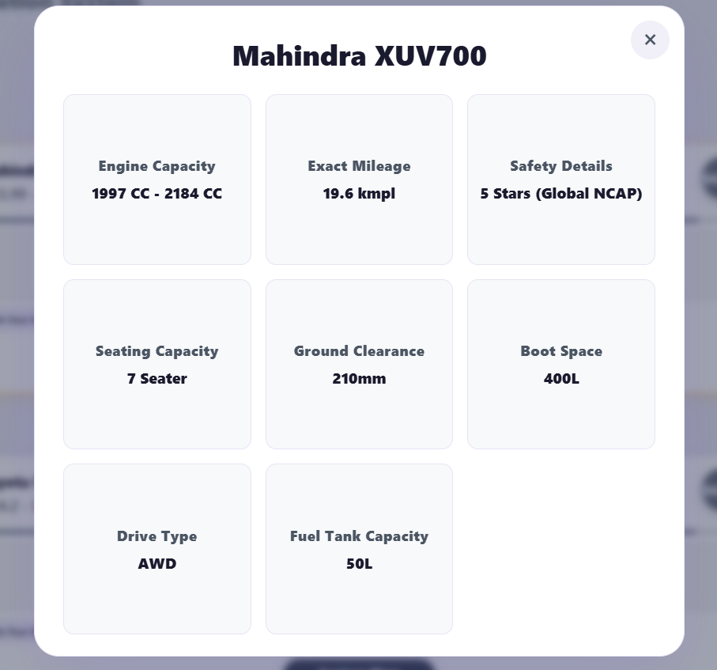

# Smart-Car-recommendation-System

## Project Overview
Smart-Car-recommendation-System is a Smart Car Recommendation System that generates personalized vehicle suggestions based on a user's profile, budget, and driving preferences.

Users provide information such as:
* Budget (in Lakhs)
* Fuel Type preference
* Transmission preference
* Body Type preference
* Minimum passenger seating capacity
* Minimum required mileage (kmpl)
* Minimum crash safety rating (stars)

Based on these inputs, the application recommends optimized car matches using a weighted multi-criteria scoring algorithm backed by a MySQL database.

The project demonstrates the use of modern full-stack development technologies by combining a React frontend, FastAPI backend, MySQL database, and Docker containerization into a scalable recommendation system.

## Why I Chose This Project
Car purchasing is often an overwhelming decision involving multiple trade-offs (e.g., budget vs. safety, mileage vs. performance). A Recommendation System solves this real-world problem by acting as an unbiased digital advisor.

I wanted to build something that doesn't just blindly filter data. This application uses a weighted scoring algorithm to find the closest matches even if a car isn't a 100% perfect fit for every single parameter. It also enforces brand diversity so users aren't flooded with recommendations from just one manufacturer, and provides dynamic key strengths to help users make informed decisions.

This project allowed me to build a practical recommendation system while applying concepts from full-stack development, database management and Docker containerization. It also provided an opportunity to integrate multiple technologies into a complete production-like application.

## What Makes This Project Special
Unlike traditional car-buying search tools that perform rigid matching, the Smart Car Recommendation System dynamically scores vehicle compatibility across multiple parameters that actually matter to buyers.

The system evaluates:
* Budget proximity and price boundaries
* Primary and secondary fuel capabilities
* Gearbox availability
* Body design configurations
* Seating capacity requirements
* Proportional safety ratings
* Proportional mileage scores

The software generates multiple recommendations sorted by match percentage, and the user can click "Explore More" on any car to inspect complete technical specifications.

## Documentation
Detailed documentation has been split into separate files for easier navigation:

* [Installation Guide](file:///d:/Project/Smart-Car-recommendation-system/INSTALL.md)
* [Usage Guide](file:///d:/Project/Smart-Car-recommendation-system/USAGE.md)
* [Architecture](file:///d:/Project/Smart-Car-recommendation-system/ARCHITECTURE.md)
* [API Documentation](file:///d:/Project/Smart-Car-recommendation-system/API_DOCUMENT.md)

## Features
* Personalized car recommendations with explanation badges
* Brand diversity filtering to ensure a variety of choices
* Explore More details listing key strengths and technical specifications
* Weighted multi-criteria scoring engine
* Input validation using Pydantic
* Fully containerized application using Docker
* Clean, responsive, modern user interface

## Technology Stack

### Backend
* Python
* FastAPI
* SQLAlchemy
* Pydantic
* Uvicorn
* PyMySQL
* Pandas

### Frontend
* React
* Axios
* CSS

### Database
* MySQL

### DevOps
* Docker
* Docker Compose

### Development Tools
* Visual Studio Code
* Git
* GitHub

## Project Structure
```text
Smart-Car-recommendation-system/
│
├── db/
│   └── init.sql
│
├── backend/
│   ├── datasets/
│   │   └── cars_in.csv
│   ├── recommender/
│   │   ├── __init__.py
│   │   ├── engine.py
│   │   └── services.py
│   ├── routers/
│   │   ├── __init__.py
│   │   └── recommend.py
│   ├── schemas/
│   │   ├── __init__.py
│   │   ├── request.py
│   │   └── response.py
│   ├── config.py
│   ├── database.py
│   ├── dockerfile
│   ├── requirements.txt
│   ├── start.sh
│   └── main.py
│
├── frontend/
│   ├── src/
│   │   ├── components/
│   │   │   ├── ExploreModal.jsx
│   │   │   ├── RecommendationForm.jsx
│   │   │   ├── ResultsPage.jsx
│   │   │   ├── Navbar.jsx
│   │   │   └── Footer.jsx
│   │   ├── styles/
│   │   │   ├── Navbar.css
│   │   │   └── Footer.css
│   │   ├── App.css
│   │   ├── App.jsx
│   │   ├── index.css
│   │   └── index.js
│   ├── public/
│   ├── dockerfile
│   └── package.json
│
├── docker-compose.yml
├── README.md
├── INSTALL.md
├── USAGE.md
├── Architecture.md
├── apidocument.md
└── LICENSE
```

## Application URLs
* **Frontend**: http://localhost:3000
* **Backend API**: http://localhost:8000
* **Swagger Documentation**: http://localhost:8000/docs

## Recommendation Modes
The recommendation engine evaluates options dynamically instead of returning a single fixed choice.

### Pre-filtering
Filters out hard constraints immediately (minimum seating bounds, minimum mileage bounds, and cars costing over 130% of user budget).

### Weighted Scoring
Assigns scores between 0 and 1 for each attribute, applying a 30% weight to budget, 20% to fuel type, 15% to transmission, 15% to safety, 10% to body type, and 5% each to seating and mileage.

### Brand Diversity Mix
Prevents single manufacturers from occupying the whole recommendation panel. It yields exactly five recommendations featuring up to five distinct car brands.

## How the Recommendation Engine Works
1. User submits car preferences via the React form.
2. FastAPI validates incoming data using Pydantic models.
3. Recommendation service loads the car dataset from the MySQL database (or cached Pandas DataFrame).
4. Hard constraints are applied (exceeding budget limits, insufficient seating, or low mileage are excluded).
5. Similarity scores are calculated for each category (budget proximity, fuel type, gearbox match, safety rating, etc.).
6. Weighted compatibility percentages are calculated.
7. Brand diversity check rearranges the results to represent multiple manufacturers.
8. Explanation tags are compiled for attributes scoring above 0.7.
9. Recommendations are returned as a JSON response.
10. React renders the ranked cards and explanation badges.

## Docker Architecture
The project consists of three independent containers:
* **Frontend**: React application container
* **Backend**: FastAPI API and Recommendation Engine container
* **Database**: MySQL database container

Docker Compose automatically creates the bridge network (`app_network`) and allows seamless communication between the containers.

## Dataset Source
* **Kaggle Source**: [Indian Cars under 20 Lakhs](https://www.kaggle.com/datasets/shiivvvaam/indian-cars-under-20-lakhs)
* **Status**: Cleaned missing values, normalized engine sizes, and manually enriched specifications (ground clearance, boot space, drive type, fuel tank capacity, and NCAP body specifications) for complete matching.
* **Logo Source**: Icons obtained from [Icons8](https://icons8.com/icons/set/favicon-car--static).

## Screenshots

### Home Page


### User Request Form


### Recommendation Cards


### Explore More


## Future Improvements
* User authentication and favorite selections profile
* Compare side-by-side specs of multiple matches
* Real-time price tracking and notifications
* Native mobile applications
* Cloud deployment on AWS/GCP

## Author
* **sakalyeakshat**
* GitHub: https://github.com/sakalyeakshat

## Acknowledgements
Open-source technologies used: FastAPI, React, Docker, MySQL, SQLAlchemy, Pydantic, Pandas, Axios. Special thanks to Kaggle for the raw dataset and Icons8 for graphics.

## Declaration
To be fully transparent, I have used Claude/AI coding tools to help speed up some of the repetitive tasks in this project:
* **Debugging Windows line-ending conflicts**: Restructuring the wait loops and handling container carriage-return issues on Windows host volume mounts.
* **Data Preprocessing & Enrichment**: Helping automate formatting scripts to clean missing values and normalize CC ranges in `cars_in.csv`.
* **Proofreading**: Checking grammar and formatting structure of the technical docs and comments.

Aside from that, the rules of recommendation, the dataset enrichment, the React components, and the Docker network structures were built by me.

## Troubleshooting

### Docker will not start
```bash
docker compose down
docker compose up --build
```

### Port already in use
Change the affected port inside `docker-compose.yml`, or stop whatever else is using that port.

### Database connection error
Confirm the following:
* The MySQL container is running.
* The Docker network was created successfully.
* The database credentials in `docker-compose.yml` match what the backend expects.
* The backend only starts after MySQL has passed its health check.

More detailed troubleshooting steps are in [INSTALL.md](file:///d:/Project/Smart-Car-recommendation-system/INSTALL.md).
