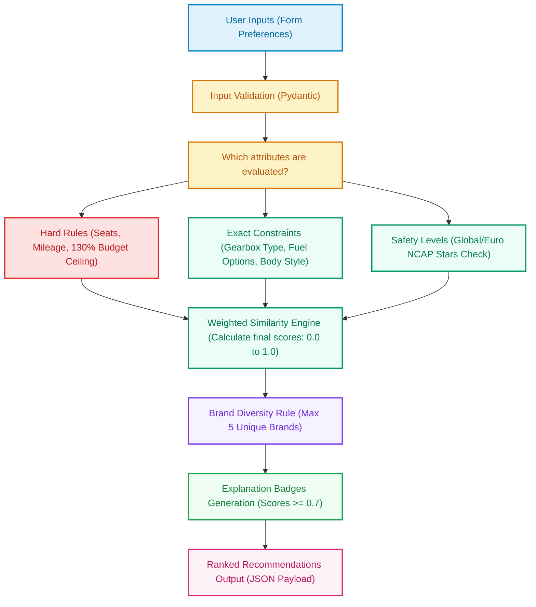
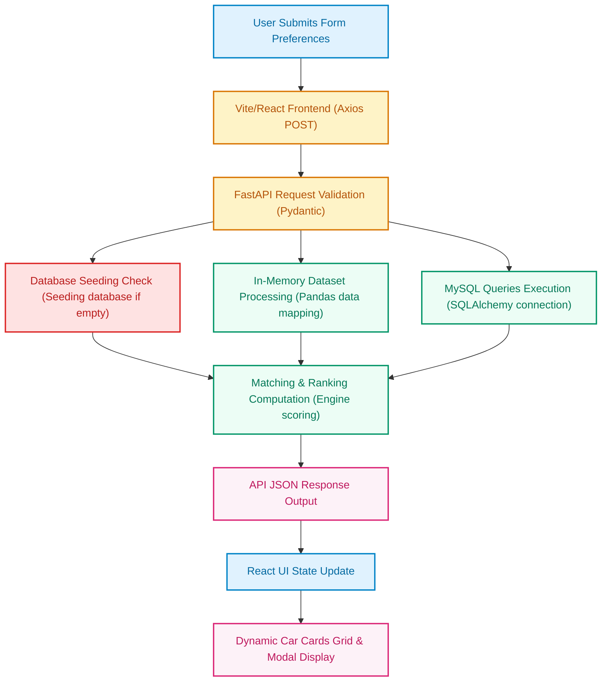

# SmartCar (Smart Car Recommendation System)

## Project Overview
SmartCar is a full-stack, containerized web application designed to help users identify their ideal vehicles based on driving profiles, budgets, and safety requirements. The application combines multi-criteria weighted matching with brand diversity filters to generate personalized recommendations that feel more comprehensive than simple rigid search lists.

The system is built using React for the frontend, FastAPI for the backend, and MySQL for the database. The entire application runs through Docker, with each tier of the system running in its own isolated container.

---

## Table of Contents
* [Features](#features)
* [Technology Stack](#technology-stack)
* [System Architecture](#system-architecture)
* [Documentation](#documentation)
* [Project Structure](#project-structure)
* [How To Install](#how-to-install)
* [Application URLs](#application-urls)
* [Database Setup](#database-setup)
* [How To Use](#how-to-use)
* [Recommendation Engine Stages](#recommendation-engine-stages)
* [Data Flow Pathway](#data-flow-pathway)
* [API Endpoints](#api-endpoints)
* [Dataset Processing](#dataset-processing)
* [Docker Environment Files](#docker-environment-files)
* [Screenshots](#screenshots)
* [Author](#author)
* [Acknowledgements](#acknowledgements)
* [AI Tools Declaration](#ai-tools-declaration)

---

## Features
* Dynamic preference form specifying budget, fuel, gearbox, seats, mileage, and safety.
* Hard constraints pre-filtering (removes cars exceeding 130% budget, having fewer seats, or less mileage).
* Weighted multi-criteria similarity scoring engine.
* Brand diversity control (ensures suggestions represent up to 5 unique brands).
* Dynamic explanation badges for positive attributes scoring $\ge 0.7$.
* Detailed specification explorer modal displaying manual dataset enrichments.
* Fully containerized environment using Docker.
* Modern, responsive, dark-themed user interface.

---

## Technology Stack

### Backend
* Python
* FastAPI
* SQLAlchemy
* Pandas
* PyMySQL
* Uvicorn

### Frontend
* React
* HTML5 / CSS3
* npm

### Database
* MySQL 8.0

### DevOps
* Docker
* Docker Compose

### Development Tools
* Visual Studio Code
* Git
* GitHub

---

## System Architecture
```text
                     User
                       │
                       ▼
                 React Frontend
                       │
             REST API POST Requests
                       │
                       ▼
                FastAPI Backend
                       │
          Weighted Recommendation Engine
                       │
                 MySQL Database
```
The frontend never communicates with the database directly. Every request goes through the backend API first, keeping the application securely separated and easier to maintain.

---

## Documentation
Detailed documentation has been organized into separate files for easier navigation:

* **[Installation Guide](INSTALL.md)** (System setup, prerequisites, and troubleshooting)
* **[Usage Guide](USAGE.md)** (User manual, form explanation, and worked example)
* **[Project Rationale](documents/Project_Rationale.md)** (Design decisions, background, and choices)
* **[Dataset & Tools Documentation](documents/dataset.md)** (Data preparation, cleaning, and seeding details)
* **[API Documentation](documents/API_DOCUMENT.md)** (Backend endpoint definitions and schemas)

---

## Project Structure
```text
Smart-Car-recommendation-system/
│
├── documents/
│   ├── API_DOCUMENT.md
│   ├── Project_Rationale.md
│   └── dataset.md
│
├── db/
│   └── init.sql
│
├── backend/
│   ├── datasets/
│   │   └── cars_in.csv
│   ├── recommender/
│   │   ├── __init__.py
│   │   ├── engine.py
│   │   └── services.py
│   ├── routers/
│   │   ├── __init__.py
│   │   └── recommend.py
│   ├── schemas/
│   │   ├── __init__.py
│   │   ├── request.py
│   │   └── response.py
│   ├── config.py
│   ├── database.py
│   ├── dockerfile
│   ├── requirements.txt
│   └── main.py
│
├── frontend/
│   ├── src/
│   │   ├── components/
│   │   │   ├── ExploreModal.jsx
│   │   │   ├── RecommendationForm.jsx
│   │   │   ├── ResultsPage.jsx
│   │   │   ├── Navbar.jsx
│   │   │   └── Footer.jsx
│   │   ├── styles/
│   │   │   ├── Navbar.css
│   │   │   └── Footer.css
│   │   ├── App.css
│   │   ├── App.jsx
│   │   ├── index.css
│   │   └── index.js
│   ├── public/
│   ├── dockerfile
│   └── package.json
│
├── docker-compose.yml
├── README.md
├── INSTALL.md
└── USAGE.md
```

---

## How To Install
Full setup instructions, prerequisites, and troubleshooting for getting the project running are in **[INSTALL.md](INSTALL.md)**.

In short, run:
```bash
git clone https://github.com/sakalyeakshat/Smart-Car-recommendation-system.git
cd Smart-Car-recommendation-system
docker compose up --build
```
Then open **[http://localhost:3000](http://localhost:3000)** in your browser.

---

## Application URLs
* **Frontend UI**: [http://localhost:3000](http://localhost:3000)
* **Backend API**: [http://localhost:8000](http://localhost:8000)
* **Swagger Documentation**: [http://localhost:8000/docs](http://localhost:8000/docs)

Full manual setup steps for running locally without Docker are detailed in **[INSTALL.md](INSTALL.md)**.

---

## Database Setup
The application uses MySQL 8.0.

When Docker Compose is executed, the following happens automatically:
1. The MySQL container starts up.
2. The database and schema are initialized.
3. The backend checks whether the database table already contains car records.
4. If the database is empty, the preprocessed Kaggle dataset `cars_in.csv` is imported.
5. If data already exists, seeding is skipped so restarting the application never creates duplicate records.

No manual database installation or seeding steps are required.

---

## How To Use
A full walkthrough of the interface, form parameter fields, and a worked example is in **[USAGE.md](USAGE.md)**.

In short, input your desired budget and preferences (fuel type, transmission, seating, body type, safety rating, and mileage), then click **Find Best Matches** to see a ranked, scored list of matching vehicles.

---

## Recommendation Engine Stages
The recommendation engine evaluates candidate vehicles in four sequential stages to determine the best matches:



### Pre-Filtering (Hard Constraints)
Instantly prunes cars that exceed 130% of the user's budget, have fewer seats than requested, or fall short of the minimum mileage criteria.

### Weighted Scoring
Evaluates and scores similarity (0.0 to 1.0) on the remaining cars. Attributes are weighted based on realistic buyer priorities:
* **Budget Proximity**: 30%
* **Fuel Type Preference**: 20%
* **Transmission Preference**: 15%
* **NCAP Safety Rating**: 15%
* **Body Style Preference**: 10%
* **Seating Capacity**: 5%
* **Fuel Efficiency / Mileage**: 5%

### Brand Diversity
Prevents a single manufacturer (e.g. Maruti or Tata) from dominating recommendations by ensuring the top results represent up to 5 unique brands.

---

## Data Flow Pathway
The end-to-end request and response cycle flows through the system components as follows:



---

## API Endpoints
| Method | Endpoint | Description |
| :--- | :--- | :--- |
| **GET** | `/` | Root verification status check. |
| **GET** | `/health` | Container and database connection health check. |
| **POST** | `/recommend` | Generates a list of vehicle recommendations based on user preferences. |

Full request and response schemas are detailed in **[documents/API_DOCUMENT.md](documents/API_DOCUMENT.md)**.

---

## Dataset Processing
This project uses the Indian Cars under 20 Lakhs dataset from Kaggle. The raw data is cleaned of null values, engine capacity string ranges are normalized to numbers, and essential parameters (ground clearance, boot space, drive type, fuel tank size) are enriched.

A full breakdown of every preprocessing step is in **[documents/dataset.md](documents/dataset.md)**.

---

## Docker Environment Files
The entire project builds and starts without any manual configuration files:
* The `docker-compose.yml` file builds and connects all three services on a custom virtual Docker network (`app_network`).
* The backend `dockerfile` sets up the Python environment, installs dependencies, and runs Uvicorn.
* The frontend `dockerfile` builds the React assets and serves them.
* The `services.py` file automatically handles database seeding.

See **[INSTALL.md](INSTALL.md)** for the full walkthrough.

---

## Screenshots

### Home Page & Request Form


### User Request Form Configuration


### Recommendation Cards


### Explore More Specifications Modal


---

## Author
* **sakalyeakshat**
* GitHub: [https://github.com/sakalyeakshat](https://github.com/sakalyeakshat)

---

## Acknowledgements
* This project was developed as a technical evaluation submission.
* Open-source technologies: FastAPI, React, Docker, MySQL, SQLAlchemy, Pydantic, Pandas.
* Special thanks to Kaggle and the dataset authors for the raw dataset.
* The reasoning behind why this project was chosen is detailed in **[documents/Project_Rationale.md](documents/Project_Rationale.md)**.

---

## AI Tools Declaration
To be fully transparent, I have used Claude/AI coding tools to help speed up repetitive tasks in this project:
* **Debugging Windows line-ending conflicts**: Restructuring the wait loops and handling container carriage-return issues on Windows host volume mounts.
* **Data Preprocessing & Enrichment**: Helping automate formatting scripts to clean missing values and normalize CC ranges in `cars_in.csv`.
* **Proofreading**: Checking grammar and formatting structure of the technical docs and comments.

Aside from that, the recommendation engine rules, the dataset enrichment, the React components, and the Docker network structures were built by me.
