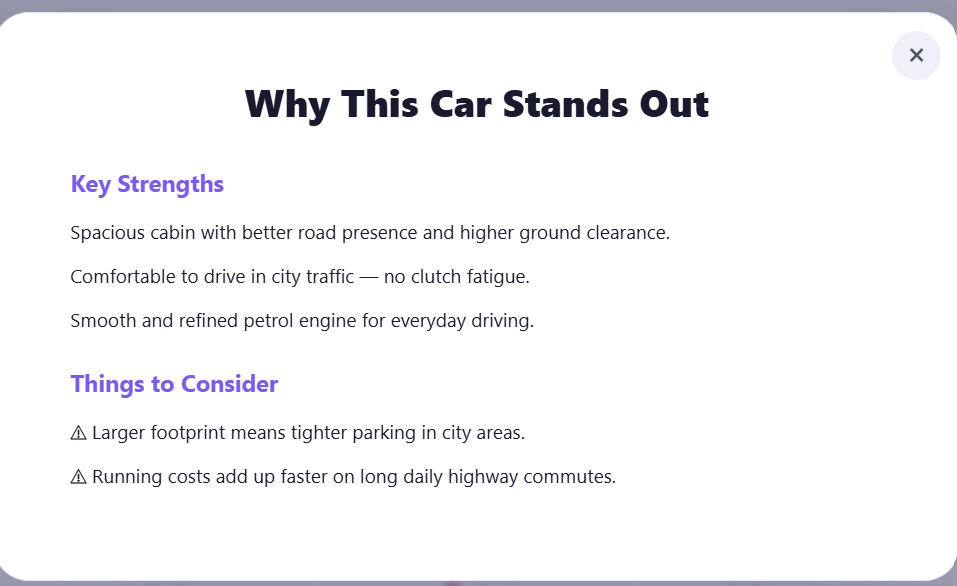

# DriveMatch AI

# 1. Project Overview

DriveMatch AI is a Smart Car Recommendation System that generates personalized vehicle recommendations based on a user's profile and preferences.

Users provide information such as:

* Budget (in Lakhs)
* Fuel Type Preference (Petrol, Diesel, CNG, Electric)
* Transmission Preference (Manual, Automatic)
* Seating Capacity
* Minimum Safety Rating (NCAP Stars)
* Body Type (Hatchback, Sedan, SUV, MUV)
* Minimum Mileage (kmpl)

Based on these inputs, the application recommends an optimized vehicle selection using a weighted multi-criteria recommendation engine backed by a MySQL database.

---

# 2. Why This Project?

This project was chosen because car purchasing is often an overwhelming decision involving multiple trade-offs (e.g., budget vs. safety, mileage vs. performance). A Recommendation System solves this real-world problem by acting as an unbiased digital advisor. 

What makes this system special is that it doesn't just blindly filter data. It uses a weighted scoring algorithm to find the closest matches even if a car isn't a 100% perfect fit for every single parameter. It also enforces brand diversity so users aren't flooded with recommendations from just one manufacturer, and provides dynamic Key Strengths and Trade-offs to help users make informed decisions.

---

# 3. What Makes This Project Special

Unlike traditional car search platforms that just apply rigid filters to a database, DriveMatch AI generates personalized vehicle recommendations based on multiple user-specific parameters that actually have significance in determining the most appropriate car for your lifestyle.

DriveMatch AI considers:

* Budget Constraints
* Fuel Type Preferences
* Transmission Types
* Seating Capacity
* Minimum Safety Ratings (NCAP)
* Body Type Styles
* Minimum Mileage (kmpl)

The Software generates multiple, dynamically scored vehicle recommendations, and the user can select and explore the specific strengths and trade-offs of any of them.

---

# 4. Features

* Personalized car recommendations with explanation badges
* Brand diversity filtering to ensure a variety of choices
* "Explore More" details listing key strengths and trade-offs
* FastAPI backend (Python-based REST API)
* React frontend (modern JavaScript framework with zero jQuery)
* MySQL database
* Containerized architecture (Frontend, Backend, and Database running in individual containers)
* Custom Docker bridge network connecting the containers
* Docker Compose support
* Responsive user interface
* Input validation using Pydantic

---

# 5. Technology Stack

## Backend
* Python
* FastAPI
* SQLAlchemy
* Pydantic
* Uvicorn
* PyMySQL
* Pandas

## Frontend
* React
* Axios
* CSS

## Database
* MySQL

## DevOps
* Docker
* Docker Compose

---

# 6. Project Architecture

```text
                    User
                      │
                      ▼
               React Frontend
                      │
              FAST API Requests
                      │
                      ▼
              FastAPI Backend
                      │
            Recommendation Engine
                      │
                      ▼
               MySQL Database
```

---

# 7. Project Structure

```text
Smart-Car-recommendation-system/
├── backend/
│   ├── schemas/
│   │   ├── request.py                 # Pydantic input models
│   │   └── response.py                # Pydantic response models
│   ├── datasets/
│   │   ├── raw/
│   │   │   └── cars_in.csv            # Source Indian Cars dataset
│   │   └── explore_and_clean.ipynb    # Jupyter Notebook for cleaning steps
│   ├── recommendation.py              # Recommendation endpoints
│   ├── services.py                    # Seeding, DB queries & weighted scoring logic
│   ├── config.py                      # Weight coefficients and configurations
│   ├── main.py                        # FastAPI entrypoint & CORS setup
│   ├── database.py                    # Database connection setup
│   ├── dockerfile                     # Backend container config
│   ├── requirements.txt               # Backend dependencies
│   └── start.sh                       # Startup shell script waiting for MySQL
│
├── frontend/
│   ├── public/
│   ├── src/
│   │   ├── components/
│   │   │   ├── ExploreModal.jsx       # Strengths/trade-offs detail modal
│   │   │   ├── RecommendationForm.jsx # Input questionnaire form
│   │   │   └── ResultsPage.jsx        # Display recommended cars grid
│   │   ├── styles/                    # Custom stylesheet components
│   │   ├── App.css                    # Global styling definitions
│   │   ├── App.jsx                    # React main router & view controller
│   │   ├── index.css
│   │   └── index.js
│   ├── dockerfile                     # Frontend container config
│   └── package.json                   # Node dependencies & run scripts
│
├── mysql/
│   └── init.sql                       # Database initialization schema
│
├── docker-compose.yml                 # Orchestration configuration
├── INSTALL.md                         # Installation & Setup Guide
├── USAGE.md                           # Application Usage Guide
└── README.md                          # Project Documentation
```

---

# 8. Installation & Setup

Please refer to INSTALL.md for full setup and teardown instructions.

---

# 9. Database Setup

The application uses MySQL.
If using Docker, the database is automatically created during startup.

The initialization script creates:
* Database
* Required tables
* Seeds initial car data from `cars_in.csv`

---

# 10. Usage Guide

Please refer to USAGE.md for full instructions on how to use the application and understand the recommendation results.

---

# 11. Validation

The backend validates all incoming requests using Pydantic.
Examples include:
* Missing fields
* Invalid values
* Incorrect data types
* Empty requests

Appropriate HTTP status codes are returned when validation fails.

---

# 12. Docker Containers

The application consists of three independent containers:

## Frontend
* React

## Backend
* FastAPI
* Recommendation Engine

## Database
* MySQL

These communicate over a Docker network managed by Docker Compose.

---

# 13. Dataset Source

The dataset is taken from Kaggle, preprocessed, structured, and more data has been added.

Original dataset:
https://www.kaggle.com/datasets/shiivvvaam/indian-cars-under-20-lakhs

---

# 14. Screenshots




---

# 15. Troubleshooting

## Docker won't start
```bash
docker compose down
docker compose up --build
```

## Port already in use
Change ports inside `docker-compose.yml` or stop the application currently using that port.

## Database connection error
Ensure:
* MySQL container is running
* Environment variables are correct
* Docker network is created successfully

---

# 16. Author

sakalyeakshat
GitHub: https://github.com/sakalyeakshat

---

# 17. Acknowledgements

Open-source technologies used:
* FastAPI
* React
* Docker
* MySQL
* SQLAlchemy
* Pydantic
* Pandas
* Axios
