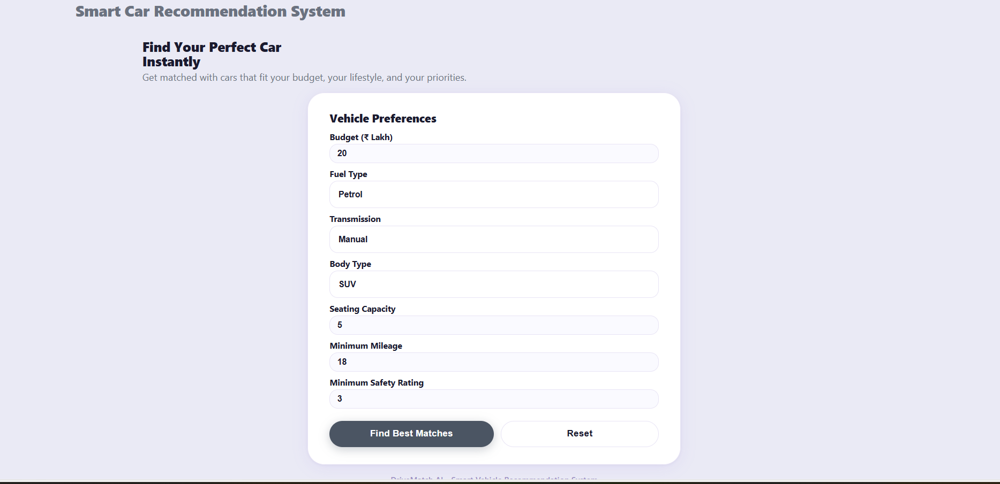
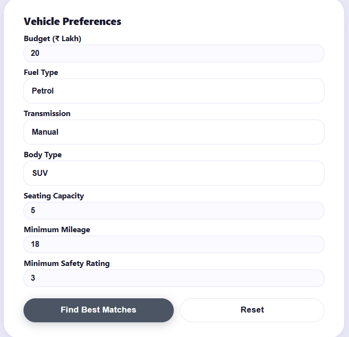
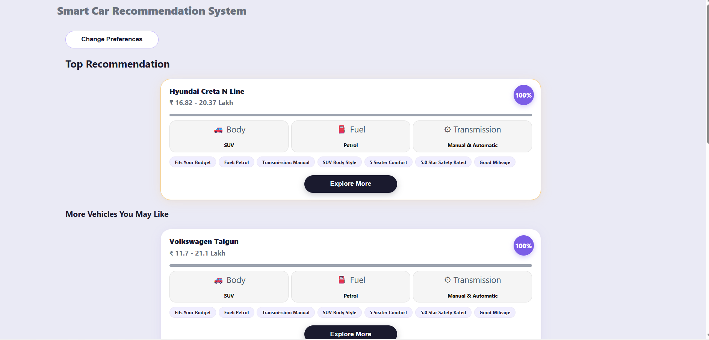

# DriveMatch AI (Smart Car Recommendation System)

## Project Overview
DriveMatch AI is a full stack web application that helps users discover the perfect car based on their budget and personal preferences. The application uses a weighted multi-criteria scoring algorithm to generate vehicle recommendations that fit the user's lifestyle.

The system is built using React for the frontend, FastAPI for the backend, and MySQL for the database. The entire application runs through Docker, with each part of the system running in its own container.

## Why I Chose This Project
Car purchasing is often an overwhelming decision involving multiple trade-offs (e.g., budget vs. safety, mileage vs. performance). A Recommendation System solves this real-world problem by acting as an unbiased digital advisor.

I wanted to build something that doesn't just blindly filter data. It uses a weighted scoring algorithm to find the closest matches even if a car isn't a 100% perfect fit for every single parameter. It also enforces brand diversity so users aren't flooded with recommendations from just one manufacturer, and provides dynamic key strengths to help users make informed decisions.

## What Makes This Project Special
Instead of relying on a single rigid matching threshold, this application dynamically scores vehicle compatibility.

If a user selects preferences like budget, fuel type, transmission, safety, and seating, the engine evaluates each car against these criteria and assigns a match percentage.

The matching engine uses pre-configured weights where budget holds the highest significance, followed by fuel type, transmission, safety rating, body style, seating capacity, and mileage. This ensures that the generated recommendations are tailored dynamically to what matters most to a car buyer.

## Features
* Personalized car recommendations with explanation badges.
* Brand diversity filtering to ensure a variety of choices.
* "Explore More" details listing key strengths and technical specifications.
* Weighted multi-criteria scoring engine.
* Input validation using Pydantic.
* Fully containerized application using Docker.
* Clean, responsive, modern user interface.

## Technology Stack

### Backend
* Python
* FastAPI
* SQLAlchemy
* PyMySQL
* Pandas

### Frontend
* React
* CSS
* Axios

### Database
* MySQL

### DevOps
* Docker
* Docker Compose

### Development Tools
* Visual Studio Code
* Git
* GitHub

## Project Architecture
```text
                    User
                      |
                      v
               React Frontend
                      |
             REST API Requests
                      |
                      v
              FastAPI Backend
                      |
            Recommendation Engine
                      |
                      v
                MySQL Database
```
The frontend never communicates with the database directly. Every request goes through the backend first, which keeps the system organized and easier to maintain.

## Project Structure
```text
Smart-Car-recommendation-system/
├── docker-compose.yml
├── README.md
├── INSTALL.md
├── USAGE.md
├── mysql/
│   └── init.sql
├── backend/
│   ├── dockerfile
│   ├── requirements.txt
│   ├── main.py
│   ├── database.py
│   ├── services.py
│   ├── config.py
│   ├── recommendation.py
│   ├── start.sh
│   ├── datasets/
│   │   └── cars_in.csv
│   └── schemas/
│       ├── request.py
│       └── response.py
└── frontend/
    ├── dockerfile
    ├── package.json
    └── src/
        ├── components/
        │   ├── ExploreModal.jsx
        │   ├── RecommendationForm.jsx
        │   └── ResultsPage.jsx
        ├── styles/
        ├── App.css
        ├── App.jsx
        ├── index.css
        └── index.js
```

## How To Install
Full setup instructions, prerequisites, and troubleshooting for getting the project running are in INSTALL.md.

In short:
```bash
git clone https://github.com/sakalyeakshat/smart-car-recommendation-system.git
cd smart-car-recommendation-system
docker compose up --build
```
Then open http://localhost:3000.

## Application URLs
* **Frontend**: http://localhost:3000
* **Backend API**: http://localhost:8000
* **Swagger Documentation**: http://localhost:8000/docs

## Running Without Docker

### Backend
Create a virtual environment:
```bash
python -m venv venv
```
Activate it on Windows:
```bash
venv\Scripts\activate
```
Activate it on Linux or macOS:
```bash
source venv/bin/activate
```
Install dependencies:
```bash
pip install -r requirements.txt
```
Ensure your local MySQL database is running and credentials match your environment variables, then run the backend:
```bash
uvicorn main:app --reload
```

### Frontend
Install dependencies:
```bash
npm install
```
Run React:
```bash
npm start
```

## Database Setup
The application uses MySQL.

When Docker Compose is executed, the following happens automatically:
1. The MySQL container starts.
2. The database is initialized via `mysql/init.sql`.
3. The backend checks whether the database table already contains data.
4. If empty, the backend imports the Kaggle dataset (`cars_in.csv`) to seed the database.
5. If data already exists, seeding is skipped so restarting the application never creates duplicate records.

No manual database setup is required.

## How To Use
A full walkthrough of the interface, what each field does, and a worked example of a recommendation request is in USAGE.md.

In short, enter your vehicle preferences (budget, fuel, transmission, seating, safety, body type, and mileage) on the form, then click **Find Best Matches** to see a dynamically ranked list of matching cars. Click **Explore More** on any car to inspect its detailed specifications.

## How the Recommendation Engine Works
1. The user submits their car preferences through the React form.
2. FastAPI receives the request and validates it using Pydantic schemas.
3. The matching engine filters out hard constraints first (cars that exceed 130% of user budget, have fewer seats than requested, or fall short of the minimum mileage).
4. For the remaining cars, it calculates matching scores for each parameter (budget, fuel, transmission, safety, body type, seating, mileage).
5. The final match percentage is calculated by applying weight coefficients (e.g., budget is weighted highest at 30%, safety at 15%, etc.) from `config.py`.
6. A brand diversity check is run to prevent recommendations from being dominated by a single manufacturer.
7. The sorted results are returned as JSON, and React renders them.

## API Endpoints
| Method | Endpoint | Description |
| :--- | :--- | :--- |
| POST | `/recommend` | Generate recommendations |
| GET | `/` | Check if backend is running |
| GET | `/health` | Check backend/Docker container health |

## Dataset Preparation
This project uses the Indian Cars under 20 Lakhs dataset available on Kaggle. The dataset contains comprehensive vehicle entries along with details like title, brand, price ranges, fuel types, transmissions, mileage ranges, safety NCAP ratings, and dimensions.

Before database seeding, missing values are handled to prevent crashes, and fields like engine size and fuel types are cleaned and normalized so they fit the structured MySQL schema. Seeding is triggered automatically by the FastAPI backend on startup if the database is empty.

## Dataset Source
Dataset used: Indian Cars under 20 Lakhs

Source: https://www.kaggle.com/datasets/shiivvvaam/indian-cars-under-20-lakhs

## Installation Files
The entire project can be started without any manual configuration.
* The `docker-compose.yml` file creates and connects all three services on a custom network.
* The backend `dockerfile` installs the Python environment and packages.
* The frontend `dockerfile` builds and serves the React application.
* The database seeding is handled natively by the backend service.

See INSTALL.md for the full setup walkthrough.

## Docker Architecture
The project consists of three independent containers connected through a custom Docker network.
* **Frontend**, built with React.
* **Backend**, built with FastAPI containing the recommendation engine.
* **Database**, running MySQL.

Docker Compose creates the network automatically and allows the three containers to communicate without any manual setup.

## Screenshots

### Home Page


### User Request Form


### Recommendation Cards


### Explore More


## Troubleshooting

### Docker will not start
```bash
docker compose down
docker compose up --build
```

### Port already in use
Change the affected port inside `docker-compose.yml`, or stop whatever else is using that port.

### Database connection error
Confirm the following:
* The MySQL container is running.
* The Docker network was created successfully.
* The database credentials in `docker-compose.yml` match what the backend expects.
* The backend only starts after MySQL has passed its health check.

More detailed troubleshooting steps are in INSTALL.md.

## Author
* **sakalyeakshat**
* GitHub: https://github.com/sakalyeakshat

## Acknowledgements
This project was developed as part of a technical recruitment assessment.

Open source technologies used: FastAPI, React, Docker, MySQL, SQLAlchemy, Pydantic, Pandas.

Thanks to Kaggle and the dataset author for making the dataset publicly available.
